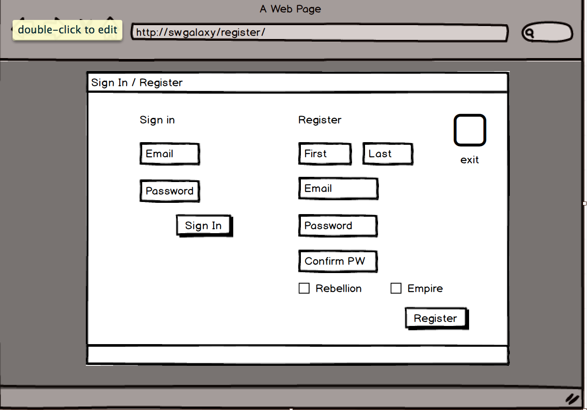

# Star Wars: A Guide to the Galaxy

## Description
I love Star Wars and who wouldnt love to travel to the exotic planets of that galaxy?  Being a huge Star Wars fan, I want to share my love of all things Star Wars with other fans.  I'm creating a travel guide for the citizens of that galaxy a long time ago and far, far away.    

First and formemost, my application will focus on the planets of the original trilogy of films.  Each planetary entry will include a picture of the planet and the conditions there.   Also, notable historical events, indigenous creatures and famous citizens from those planets will be included with information on each.  Some of the most notable events will include videos.   Finally, each planet will be designated as allied with the Empire, Rebellion or neutral for the safety of the visitor.        

Additional features will include the following:

1.  A view of the galaxy where the user can click on a planet to open the appropriate entry.
2.  A blog where registered citizens will be able to describe their own visits to the planets.  This will be fan fiction.
3.  A registration system where the user can identify as a member of the empire or the rebellion when they log in.  This will result in the interface theme changing to appropriate colors and logos.  Also, only registered users can submit blog entries.   

## User Stories
[user stories](https://trello.com/b/YzkaM1vF/star-wars-a-guide-to-the-galaxy)

## Wireframes

Home Page / Galaxy View

Sign-in / Register

Planet View w/ Blog

## Models

## APIs, Plugins, Libraries and Frameworks  
APIs:
[star wars api](http://swapi.co)

This is for the planet images:  

[star wars wiki](http://starwars.wikia.com/wiki/Main_Page)

Front end Framework:

React  

Perk

Skeleton

Back end Framework: 

Node

Bookshelf 

## How to reach me
email: mhgrossmann@yahoo.com

